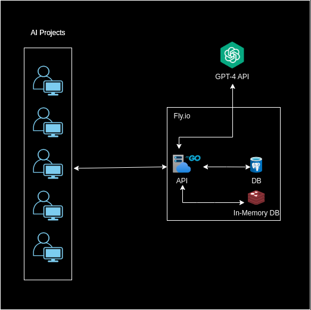

# **ChatGPT API Wrapper Documentation**

## **Table of Contents**

1. [Introduction](#1-introduction)
2. [System Architecture](#2-system-architecture)
3. [Infrastructure](#3-infrastructure)
4. [API Development](#4-api-development)
    1. [Go Implementation](#41-go-implementation)
    2. [Routing with muxpatterns](#42-routing-with-muxpatterns)
5. [Databases](#5-databases)
    1. [PostgreSQL](#51-postgresql)
    2. [Redis](#52-redis)

---

## **1. Introduction**

This project serves as a wrapper for the ChatGPT API, tailored specifically for five different AI projects. Instead of these AI projects directly interfacing with the GPT-4 API, they will leverage this wrapper API. The intention is to abstract away complexities related to GPT-4 integration, prompt configurations, and other intricacies, providing a more streamlined experience for the AI projects. The primary development language is Go, with PostgreSQL serving as the main database and Redis being used for caching and authentication.

---

## **2. System Architecture**

The system is structured into several key components, each fulfilling specific roles:

- **AI Projects**: These are the various initiatives or applications that require AI-powered responses. They send their requests to the Go API rather than directly interacting with GPT-4. It acts as a centralized gateway for these projects.

- **Go API**: This is the heart of our architecture. It's responsible for receiving client queries from AI projects, processing them, and then communicating with the GPT-4 API to get the desired responses.

- **GPT-4 API**: An endpoint provided by OpenAI, this powerful engine processes the requests sent by our Go API and returns appropriate AI-generated responses.

- **DB (PostgreSQL)**: This is where all the data is stored. It archives every query made by the clients and the corresponding responses from the GPT-4 API, ensuring a historical record is maintained.

- **In-Memory DB (Redis)**: An essential part of the architecture, Redis improves the system's efficiency by caching frequent responses and managing API keys for authentication.

---

## **3. Infrastructure**

All primary components, including the Go API, PostgreSQL database, and Redis instance, are hosted on `fly.io`. This choice was influenced by:

- **Seamless Deployment**: `fly.io` provides a straightforward deployment process, reducing friction from development to production.

- **Global Reach**: With its widespread data centers, `fly.io` ensures fast responses regardless of the user's location.

- **Cost-Effective**: A generous free tier makes it a budget-friendly option for projects at this scale.

Future Considerations:
Post successful implementation, there are plans to evolve the project's architecture and infrastructure. The next phase involves migrating and refactoring the system to embrace a serverless API using Amazon Web Services (AWS) and Infrastructure as Code (IaC) with the Cloud Development Kit (CDK). This shift aims to further optimize scalability and operational efficiency.

---

## **4. API Development**

### **4.1. Go Implementation**

Go was selected primarily for its simplicity, offering a clean and straightforward syntax that aids in rapid development. Its efficiency, especially during development and deployment, further cements its place as the language of choice for this project. Additionally, the project employs the standard SQL package, streamlining the integration with the PostgreSQL database.

### **4.2. Routing with muxpatterns**

Routing for this API is facilitated by `muxpatterns`. It provides functionality akin to the upcoming `http.ServeMux` in Go 1.22. For more details, refer to the [muxpatterns GitHub Repo](https://github.com/jba/muxpatterns).

---

## **5. Databases**

### **5.1. PostgreSQL**

PostgreSQL was chosen as it's a robust SQL database. The decision to use an SQL database like PostgreSQL stemmed from having a well-defined information structure that can be easily translated into tables in a database.

**Tables:**

1. **Inputs**:
   - Purpose: Store client inputs that are passed to the GPT-4 API.
   - Columns:
     - `id`: Unique identifier for each input.
     - `content`: Text of the input query.
     - `timestamp`: Time the query was made.

2. **Responses**:
   - Purpose: Store responses from the GPT-4 API.
   - Columns:
     - `id`: Unique identifier for each response.
     - `input_id`: Reference to the corresponding input.
     - `content`: Text of the response from ChatGPT.
     - `timestamp`: Time the response was received.

### **5.2. Redis**

Redis, our in-memory database, is utilized for two primary purposes:

1. **Caching**: Responses from the GPT-4 API can be cached to improve speed and reduce redundant requests.

2. **Authentication**: Redis will be responsible for managing and verifying API keys sent by clients, ensuring that only authorized requests are processed.
